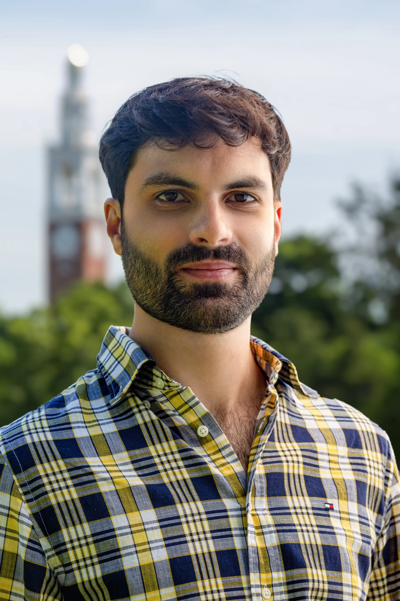
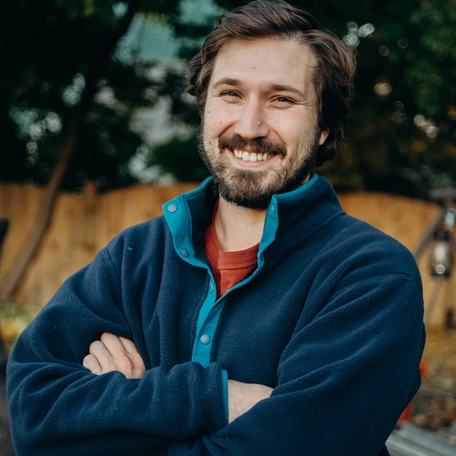

# Getting started

Welcome to MOCS Fall 2024. This is the support website where we will share most of the content for the class, except for the homeworks. Homeworks will be available on Brightspace.

How is this website organized?

- You can find a bibliography [here](./refs). 
- You can find extra ressources for computer sciency stuff (Github, Python, Julia, etc) in [here](./extra-ressources). 
- For each module,
    - We will share some introductory videos and readings on the module's getting started page.
    - We will share fun, interactive content related to the module

## Who are we?

    <a href="htttps://socks.w3.uvm.edu/socks/node/38?rnd=0.1937717982807522#giulioburgio" target="_blank">
        <picture style="width: 65%;">
            <source srcset="./assets/Giulio.webp" media="(prefers-color-scheme: dark)">
            
        </picture>
        
Giulio Burgio (co-lead instructor)

    </a>
    <a href="https://jstonge.vercel.app/" target="_blank">
        <picture>
            <source srcset="./assets/jso.webp" media="(prefers-color-scheme: dark)">
            
        </picture>
        
Jonathan St-Onge (co-lead instructor)

    </a>
    <a href="https://www.linkedin.com/in/prianka-bhattacharjee-bb7a69109/" target="_blank">
        <picture>
            <source srcset="./assets/prianka.webp" media="(prefers-color-scheme: dark)">
            
        </picture>
        
Prianka (teaching assistant)

    </a>

## What is complexity

Laurent Hébert-Dufresne gave the following answer to a journalist:

<figure class="quote">
  <blockquote>
    Let’s talk about complex systems instead. They’re easier to define than complexity! Complex systems are opposed not to simple systems, but to <strong>separable systems</strong>. And often different parts of these systems have different natures that we study with different disciplines. They may be sociotechnical systems that involve both algorithms, technology and engineering, and humans and social biases and so forth. And so, by their nature, we need to study them with tools from different disciplines and with dialogues across different expertise.
      
    Now, I don't think that “complexity science” is a science. I think we use the phrase a lot and it depends on how you want to define a science. But complexity science doesn't have a shared set of questions, systems of interest, or tools. It's all over the place.
      
    So, I use “complexity” almost as virtue signaling—to group the subfield of scientists interested in studying these complex systems and open to doing it with tools and perspective from different disciplines. Identifying with “complexity” is a signal that you're open to dialogue and weird ideas more so than a defined science. So that's why it's not npj complexity science, it's npj complexity. It's more of a perspective or a mentality and less of a science. That's how I see it. And I think that's the identity of the journal. No particular systems of interest, but more about a perspective with which we do many kinds of science.
  </blockquote>
  <figcaption>
    &mdash; LHD's answer, <cite><a href="https://www.uvm.edu/news/story/honeybees-hate-speech">Honeybees to Hate Speech</a></cite>  </figcaption>
</figure>

In this class, we will seek to understand his definition. But at the end, you should have your own's answer to that question. You should be able to say if you agree or disagree with LHD's answer.

### The interactivity of complex systems

 - [Complexity Explorables](https://www.complexity-explorables.org/)

## About ChatGPT

[TODO: statement about chatGPT. How we could use the specific ways how chatGPT is wrong as a way to make better exercice.]

