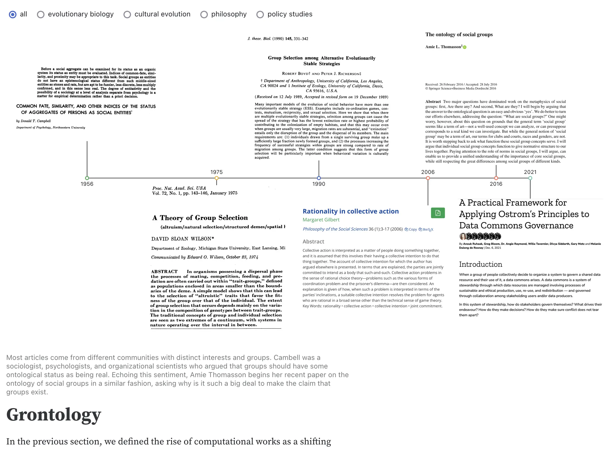

  <h1>Modeling of Complex Systems</h1>
  <h2>Welcome to MOCS Fall 2024! </h2>
  <a href="https://mocs.observablehq.com/2024FALL-MOCS/getting-started/" target="_blank">First lesson↗︎</a>

    <a href="https://jstonge.observablehq.cloud/hello-research-groups/grontology" target="_blank">
    <picture>
        <source srcset="./assets/defining.webp" media="(prefers-color-scheme: dark)">
        
    </picture>
    
💡 ODEs

    </a>
    <a href="https://jstonge.observablehq.cloud/hello-research-groups/grontology" target="_blank">
    <picture>
        <source srcset="./assets/defining.webp" media="(prefers-color-scheme: dark)">
        
    </picture>
    
💡 Cellular automata

    </a>
    <a href="https://jstonge.observablehq.cloud/hello-research-groups/grontology" target="_blank">
    <picture>
        <source srcset="./assets/defining.webp" media="(prefers-color-scheme: dark)">
        
    </picture>
    
💡 Networks

    </a>
    <a href="https://jstonge.observablehq.cloud/hello-research-groups/grontology" target="_blank">
    <picture>
        <source srcset="./assets/defining.webp" media="(prefers-color-scheme: dark)">
        
    </picture>
    
💡 ABMs

    </a>

